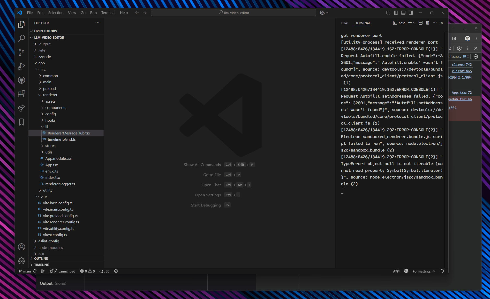
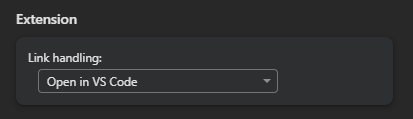

# Open in VS Code

Jump from Chrome Devtools to VS Code with a single click.

## Usage

## Installation

- Download the latest release
- Install the VS Code plugin ("Install from VSIX…")
- Install the Chrome extension (["Load unpacked"](https://developer.chrome.com/docs/extensions/mv3/getstarted/development-basics/#load-unpacked))
- Open Devtools settings and set "Open in VS Code" as the default link handler: 

## Development

1. Build and install VS Code extension to handle the custom URI
    - In `vscode-extension` run `pnpm vsce prepare`
2. Build and install the Chrome extension
    - In `chrome-extension` run `pnpm build`

## Contributing

Let me know if this is useful and I'll publish the extensions to Chrome and
VS Code marketplaces.

Open an issue or PR if you have any suggestions or improvements.
